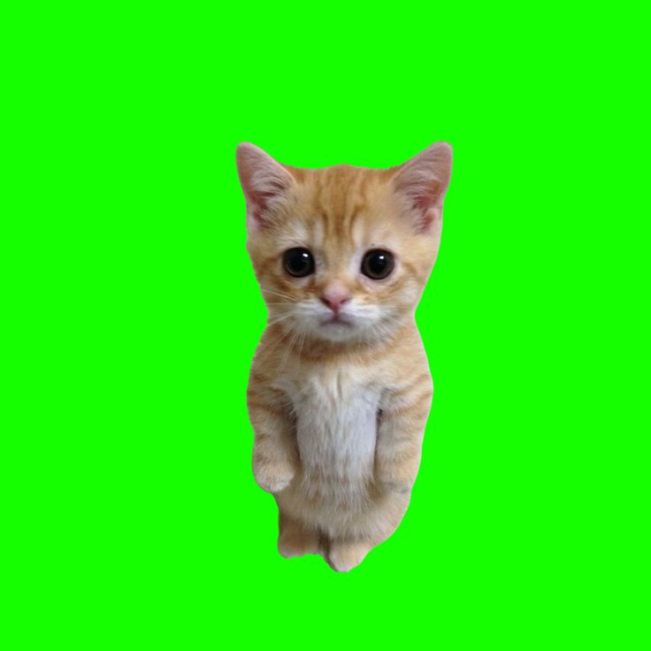

# Background Changer
## Описание
Background Changer — это Python-скрипт для удаления фона с изображения (например, зелёного экрана) и замены его на новое фоновое изображение. Скрипт использует библиотеку OpenCV для обработки изображений, применяя цветовую сегментацию в пространстве HSV, морфологические операции для улучшения маски и наложение объекта на новый фон с использованием альфа-канала.

## Основные функции:

- Загрузка и проверка входных изображений.
- Удаление фона на основе цветового диапазона (по умолчанию — зелёный фон).
- Создание бинарной маски для выделения объекта.
- Наложение объекта на новое фоновое изображение.
- Сохранение и отображение результата.

## Зависимости

- Python 3.6+
- opencv-python (>=4.11.0)
- numpy (>=1.19.0)


Установите зависимости с помощью:
```
pip install opencv-python numpy
```
## Установка

- [x] Склонируйте репозиторий или скачайте файл background_changing.py.
- [x] Убедитесь, что установлены необходимые библиотеки (см. раздел "Зависимости").
- [x] Поместите входное изображение (image1.jpg) и фоновое изображение (background1.jpg) в ту же директорию, где находится скрипт, или укажите правильные пути к файлам.

## Использование

### Подготовьте входные данные:

- [ ] Входное изображение (image1.jpg): Изображение с объектом на зелёном фоне (или другом фоне, для которого можно настроить HSV-диапазон).
- [ ] Фоновое изображение (background1.jpg): Изображение, которое будет использоваться как новый фон.
Имя выходного файла (out.jpg): Путь для сохранения результата.

### Запустите скрипт:
```
python background_changing.py
```
По умолчанию скрипт использует файлы image1.jpg и background1.jpg, сохраняет результат в out.jpg и отображает его в окне (параметр showRes=True).

Это обработает image1.jpg, заменит фон на background1.jpg и сохранит результат в out.jpg.

## Диагностика (опционально):

Если раскомментировать строки в функции remove, скрипт сохранит промежуточные файлы:
mask.jpg: Бинарная маска (объект = белый, фон = чёрный).
result_remove.jpg: Объект на чёрном фоне (BGR-часть результата).

## Пример
### Входные данные

 
.

### Результат

.

## Ограничения

Скрипт оптимизирован для изображений с зелёным фоном. Для других цветов фона нужно настроить HSV-диапазон (lower_color_green, upper_color_green) в функции create_mask. Если объект содержит цвета, близкие к фону, маска может быть неточной. В таких случаях можно использовать альтернативные методы сегментации, например, GrabCut.